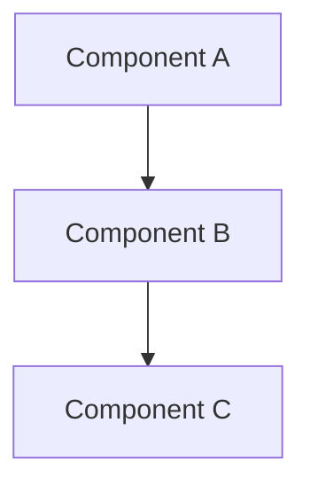

# spike-mcp Implementation Plan

> **For agentic workers:** REQUIRED SUB-SKILL: Use superpowers:subagent-driven-development (recommended) or superpowers:executing-plans to implement this plan task-by-task. Steps use checkbox (`- [ ]`) syntax for tracking.

**Goal:** Build and package a Python MCP server that connects Claude Code to Jira and Confluence for AI-assisted spike research, diagram generation, and ticket creation.

**Architecture:** A single Python package with five internal modules. `server.py` creates a `FastMCP` instance and registers 8 tools and 1 prompt via closure over `ConfluenceClient`/`JiraClient` instances. All Atlassian auth uses HTTP Basic (email:api_token base64). Markdown→Confluence storage format and markdown→ADF conversions use line-by-line regex — no HTML parser needed.

**Tech Stack:** Python 3.11+, `mcp>=1.0.0` (FastMCP), `httpx>=0.27.0`, `pydantic>=2.0.0`, `pytest`, `pytest-asyncio` (asyncio_mode=auto), `respx` (httpx mock library)

---

## File Map

| File | Responsibility |
|---|---|
| `spike_mcp/__init__.py` | Package version |
| `spike_mcp/config.py` | `.spike.toml` loading, Pydantic models, env token injection |
| `spike_mcp/templates.py` | `SPIKE_DOC_TEMPLATE`, `STORY_TEMPLATE`, `SYSTEM_PROMPT` |
| `spike_mcp/confluence.py` | `_inline_md`, `_md_to_storage`, `_strip_html`, `ConfluenceClient` |
| `spike_mcp/jira.py` | `_inline_adf`, `_md_to_adf`, `JiraClient` |
| `spike_mcp/server.py` | `create_server()`, `main()` — 8 tools + spike_workflow prompt |
| `tests/conftest.py` | Shared `spike_config` fixture |
| `tests/test_config.py` | Config loading unit tests |
| `tests/test_templates.py` | Template structure assertions |
| `tests/test_confluence_converters.py` | `_md_to_storage` and `_strip_html` unit tests |
| `tests/test_confluence_client.py` | `ConfluenceClient` with respx mocks |
| `tests/test_jira_converters.py` | `_md_to_adf` and `_inline_adf` unit tests |
| `tests/test_jira_client.py` | `JiraClient` with respx mocks |
| `tests/test_server.py` | MCP tool and prompt registration tests |
| `pyproject.toml` | Build config, entry point, deps |
| `.spike.toml.example` | Template config file |
| `README.md` | Install, setup, usage |

---

### Task 1: Project scaffold

**Files:**
- Create: `pyproject.toml`
- Create: `spike_mcp/__init__.py`
- Create: `tests/__init__.py`
- Create: `tests/conftest.py`

- [ ] **Step 1: Create package directories**

```bash
mkdir -p spike_mcp tests
```

- [ ] **Step 2: Write `pyproject.toml`**

```toml
[build-system]
requires = ["hatchling"]
build-backend = "hatchling.build"

[project]
name = "spike-mcp"
version = "0.1.0"
description = "MCP server for AI-powered spike research and Jira/Confluence automation"
requires-python = ">=3.11"
dependencies = [
    "mcp>=1.0.0",
    "httpx>=0.27.0",
    "pydantic>=2.0.0",
]

[project.scripts]
spike-mcp = "spike_mcp.server:main"

[project.optional-dependencies]
dev = [
    "pytest>=8.0.0",
    "pytest-asyncio>=0.23.0",
    "respx>=0.21.0",
]

[tool.pytest.ini_options]
asyncio_mode = "auto"
```

- [ ] **Step 3: Write `spike_mcp/__init__.py`**

```python
__version__ = "0.1.0"
```

- [ ] **Step 4: Write `tests/__init__.py`**

Empty file — just `touch tests/__init__.py`.

- [ ] **Step 5: Write `tests/conftest.py`**

```python
import pytest
from spike_mcp.config import (
    AtlassianConfig,
    ConfluenceConfig,
    JiraConfig,
    SpikeConfig,
    TicketsConfig,
)


@pytest.fixture
def spike_config() -> SpikeConfig:
    return SpikeConfig(
        atlassian=AtlassianConfig(
            base_url="https://test.atlassian.net",
            email="test@example.com",
        ),
        confluence=ConfluenceConfig(space_key="ENG", parent_page_id="999"),
        jira=JiraConfig(
            project_key="PLAT",
            epic_issue_type="Epic",
            story_issue_type="Story",
            task_issue_type="Task",
            default_label="spike",
            story_points_field="customfield_10016",
            epic_link_field="customfield_10014",
        ),
        tickets=TicketsConfig(),
        api_token="test-token-abc",
    )
```

- [ ] **Step 6: Install package and dev dependencies**

```bash
pip install -e ".[dev]"
```

Expected: `Successfully installed spike-mcp-0.1.0` (plus deps).

- [ ] **Step 7: Verify pytest collects nothing yet**

```bash
pytest --collect-only
```

Expected: `no tests ran`

- [ ] **Step 8: Commit**

```bash
git add pyproject.toml spike_mcp/__init__.py tests/__init__.py tests/conftest.py
git commit -m "feat: scaffold spike-mcp package"
```

---

### Task 2: Config module

**Files:**
- Create: `tests/test_config.py`
- Create: `spike_mcp/config.py`

- [ ] **Step 1: Write `tests/test_config.py`**

```python
import pytest
from pathlib import Path
from spike_mcp.config import (
    _find_toml,
    load_config,
    SpikeConfig,
)

MINIMAL_TOML = """
[atlassian]
base_url = "https://myorg.atlassian.net"
email = "user@example.com"

[confluence]
space_key = "ENG"
parent_page_id = "111"

[jira]
project_key = "PLAT"
"""

FULL_TOML = MINIMAL_TOML + """
[tickets]
story_point_scale = [1, 2, 3, 5, 8]
"""


def test_find_toml_explicit_path(tmp_path: Path):
    cfg = tmp_path / ".spike.toml"
    cfg.write_text(MINIMAL_TOML)
    assert _find_toml(str(cfg)) == cfg


def test_find_toml_explicit_path_missing(tmp_path: Path):
    with pytest.raises(FileNotFoundError, match="not found"):
        _find_toml(str(tmp_path / "nonexistent.toml"))


def test_find_toml_in_cwd(tmp_path: Path, monkeypatch: pytest.MonkeyPatch):
    cfg = tmp_path / ".spike.toml"
    cfg.write_text(MINIMAL_TOML)
    monkeypatch.chdir(tmp_path)
    assert _find_toml() == cfg


def test_find_toml_walks_up_to_git_root(tmp_path: Path, monkeypatch: pytest.MonkeyPatch):
    (tmp_path / ".git").mkdir()
    cfg = tmp_path / ".spike.toml"
    cfg.write_text(MINIMAL_TOML)
    subdir = tmp_path / "src" / "app"
    subdir.mkdir(parents=True)
    monkeypatch.chdir(subdir)
    assert _find_toml() == cfg


def test_find_toml_home_fallback(tmp_path: Path, monkeypatch: pytest.MonkeyPatch):
    monkeypatch.chdir(tmp_path)
    home_cfg = tmp_path / ".spike.toml"
    home_cfg.write_text(MINIMAL_TOML)
    monkeypatch.setattr(Path, "home", classmethod(lambda cls: tmp_path))
    assert _find_toml() == home_cfg


def test_find_toml_not_found_raises(tmp_path: Path, monkeypatch: pytest.MonkeyPatch):
    monkeypatch.chdir(tmp_path)
    monkeypatch.setattr(Path, "home", classmethod(lambda cls: tmp_path))
    with pytest.raises(FileNotFoundError, match=".spike.toml"):
        _find_toml()


def test_load_config_missing_token(tmp_path: Path, monkeypatch: pytest.MonkeyPatch):
    cfg = tmp_path / ".spike.toml"
    cfg.write_text(MINIMAL_TOML)
    monkeypatch.delenv("ATLASSIAN_API_TOKEN", raising=False)
    with pytest.raises(SystemExit, match="ATLASSIAN_API_TOKEN"):
        load_config(str(cfg))


def test_load_config_token_in_toml_raises(tmp_path: Path, monkeypatch: pytest.MonkeyPatch):
    bad_toml = """
[atlassian]
base_url = "https://myorg.atlassian.net"
email = "user@example.com"
api_token = "secret"
"""
    cfg = tmp_path / ".spike.toml"
    cfg.write_text(bad_toml)
    monkeypatch.setenv("ATLASSIAN_API_TOKEN", "env-token")
    with pytest.raises(SystemExit, match="api_token"):
        load_config(str(cfg))


def test_load_config_success(tmp_path: Path, monkeypatch: pytest.MonkeyPatch):
    cfg = tmp_path / ".spike.toml"
    cfg.write_text(MINIMAL_TOML)
    monkeypatch.setenv("ATLASSIAN_API_TOKEN", "my-secret-token")
    result = load_config(str(cfg))
    assert isinstance(result, SpikeConfig)
    assert result.atlassian.base_url == "https://myorg.atlassian.net"
    assert result.atlassian.email == "user@example.com"
    assert result.confluence.space_key == "ENG"
    assert result.jira.project_key == "PLAT"
    assert result.api_token == "my-secret-token"


def test_load_config_defaults(tmp_path: Path, monkeypatch: pytest.MonkeyPatch):
    minimal = """
[atlassian]
base_url = "https://myorg.atlassian.net"
email = "user@example.com"
"""
    cfg = tmp_path / ".spike.toml"
    cfg.write_text(minimal)
    monkeypatch.setenv("ATLASSIAN_API_TOKEN", "tok")
    result = load_config(str(cfg))
    assert result.tickets.story_point_scale == [1, 2, 3, 5, 8, 13]
    assert result.jira.epic_issue_type == "Epic"
    assert result.jira.default_label == "spike"


def test_load_config_custom_story_point_scale(tmp_path: Path, monkeypatch: pytest.MonkeyPatch):
    cfg = tmp_path / ".spike.toml"
    cfg.write_text(FULL_TOML)
    monkeypatch.setenv("ATLASSIAN_API_TOKEN", "tok")
    result = load_config(str(cfg))
    assert result.tickets.story_point_scale == [1, 2, 3, 5, 8]
```

- [ ] **Step 2: Run tests — verify they fail**

```bash
pytest tests/test_config.py -v
```

Expected: `ModuleNotFoundError: No module named 'spike_mcp.config'`

- [ ] **Step 3: Write `spike_mcp/config.py`**

```python
from __future__ import annotations

import os
import tomllib
from pathlib import Path
from typing import Optional

from pydantic import BaseModel


class AtlassianConfig(BaseModel):
    base_url: str
    email: str


class ConfluenceConfig(BaseModel):
    space_key: str = ""
    parent_page_id: str = ""


class JiraConfig(BaseModel):
    project_key: str = ""
    epic_issue_type: str = "Epic"
    story_issue_type: str = "Story"
    task_issue_type: str = "Task"
    default_label: str = "spike"
    story_points_field: str = "customfield_10016"
    epic_link_field: str = "customfield_10014"


class TicketsConfig(BaseModel):
    story_point_scale: list[int] = [1, 2, 3, 5, 8, 13]


class SpikeConfig(BaseModel):
    atlassian: AtlassianConfig
    confluence: ConfluenceConfig = ConfluenceConfig()
    jira: JiraConfig = JiraConfig()
    tickets: TicketsConfig = TicketsConfig()
    api_token: str


def _find_toml(explicit_path: Optional[str] = None) -> Path:
    if explicit_path:
        p = Path(explicit_path)
        if not p.exists():
            raise FileNotFoundError(f"Config file not found: {explicit_path}")
        return p

    current = Path.cwd()
    while True:
        candidate = current / ".spike.toml"
        if candidate.exists():
            return candidate
        if (current / ".git").exists() or current.parent == current:
            break
        current = current.parent

    home_config = Path.home() / ".spike.toml"
    if home_config.exists():
        return home_config

    raise FileNotFoundError(
        "No .spike.toml found. Create one in your project root or at ~/.spike.toml.\n"
        "Run: cp .spike.toml.example .spike.toml  (then edit with your values)"
    )


def load_config(explicit_path: Optional[str] = None) -> SpikeConfig:
    api_token = os.environ.get("ATLASSIAN_API_TOKEN", "")
    if not api_token:
        raise SystemExit(
            "ATLASSIAN_API_TOKEN environment variable is not set.\n"
            "Generate at: https://id.atlassian.com/manage-profile/security/api-tokens\n"
            "Then: export ATLASSIAN_API_TOKEN='your-token-here'"
        )

    toml_path = _find_toml(explicit_path)
    with open(toml_path, "rb") as f:
        data = tomllib.load(f)

    if "api_token" in data.get("atlassian", {}):
        raise SystemExit(
            "Do not put api_token in .spike.toml — use the ATLASSIAN_API_TOKEN "
            "environment variable instead."
        )

    return SpikeConfig(
        atlassian=AtlassianConfig(**data["atlassian"]),
        confluence=ConfluenceConfig(**data.get("confluence", {})),
        jira=JiraConfig(**data.get("jira", {})),
        tickets=TicketsConfig(**data.get("tickets", {})),
        api_token=api_token,
    )
```

- [ ] **Step 4: Run tests — verify they pass**

```bash
pytest tests/test_config.py -v
```

Expected: `10 passed`

- [ ] **Step 5: Commit**

```bash
git add spike_mcp/config.py tests/test_config.py
git commit -m "feat: add config module with .spike.toml discovery and env token injection"
```

---

### Task 3: Templates module

**Files:**
- Create: `tests/test_templates.py`
- Create: `spike_mcp/templates.py`

- [ ] **Step 1: Write `tests/test_templates.py`**

```python
from spike_mcp.templates import SPIKE_DOC_TEMPLATE, STORY_TEMPLATE, SYSTEM_PROMPT


def test_spike_doc_has_required_sections():
    for section in [
        "Overview",
        "Problem Statement",
        "Goals",
        "Proposed Solution",
        "Architecture Diagram",
        "Implementation Options",
        "Recommendation",
        "Epic",
        "Story",
        "References",
    ]:
        assert section in SPIKE_DOC_TEMPLATE, f"Missing section: {section}"


def test_spike_doc_has_mermaid_placeholder():
    assert "```mermaid" in SPIKE_DOC_TEMPLATE


def test_story_template_is_formattable():
    result = STORY_TEMPLATE.format(
        context="Background info",
        what="Implement the thing",
        acceptance_criteria="1. It works",
        out_of_scope="Nothing else",
        notes="TBD",
    )
    assert "Background info" in result
    assert "Implement the thing" in result
    assert "1. It works" in result


def test_system_prompt_research_first():
    assert "search_confluence" in SYSTEM_PROMPT
    assert "search_jira" in SYSTEM_PROMPT


def test_system_prompt_requires_mermaid():
    assert "mermaid" in SYSTEM_PROMPT.lower()


def test_system_prompt_confirm_before_write():
    assert "get_project_config" in SYSTEM_PROMPT
    assert "confirm" in SYSTEM_PROMPT.lower() or "confirmation" in SYSTEM_PROMPT.lower()


def test_system_prompt_fibonacci_scale():
    assert "fibonacci" in SYSTEM_PROMPT.lower() or "Fibonacci" in SYSTEM_PROMPT


def test_system_prompt_imperative_verb():
    assert "imperative" in SYSTEM_PROMPT.lower()
```

- [ ] **Step 2: Run tests — verify they fail**

```bash
pytest tests/test_templates.py -v
```

Expected: `ModuleNotFoundError: No module named 'spike_mcp.templates'`

- [ ] **Step 3: Write `spike_mcp/templates.py`**

```python
SPIKE_DOC_TEMPLATE = """\
## Overview

<!-- One paragraph describing what this spike is investigating -->

## Problem Statement

<!-- What problem are we solving? What is the current pain point? -->

## Goals & Non-goals

**Goals:**
-

**Non-goals:**
-

## Proposed Solution

<!-- High-level description of the proposed approach -->

## Architecture Diagram



## Implementation Options

### Option 1: [Name]
**Pros:**
**Cons:**

### Option 2: [Name]
**Pros:**
**Cons:**

## Recommendation

<!-- Which option and why -->

## Epic + Story Breakdown

<!-- Links to Jira epic and stories will go here -->

## References

-
"""

STORY_TEMPLATE = """\
**Context**
{context}

**What needs to be done**
{what}

**Acceptance Criteria**
{acceptance_criteria}

**Out of scope**
{out_of_scope}

**Notes / Open Questions**
{notes}
"""

SYSTEM_PROMPT = """\
You are helping an engineering team run a technical spike using the spike-mcp tools.

## Workflow

1. **Research first** — Before generating any content, call `search_confluence` and \
`search_jira` to find existing documentation and related tickets. Summarise what you find.

2. **Design with diagrams** — Every spike doc must include a Mermaid architecture or \
flow diagram. Use ```mermaid fenced blocks in the body_markdown you pass to `write_spike_doc`.

3. **Structure work correctly** — Break down the implementation as:
   - 1 Epic (the overall initiative)
   - Multiple Stories, each 3–8 story points on the Fibonacci scale (1, 2, 3, 5, 8, 13)
   - Tasks only for very small items that don't warrant a story

4. **Write good tickets** — Every Jira ticket must have:
   - One-line summary starting with an imperative verb ("Implement...", "Add...", "Migrate...")
   - A context paragraph explaining the why
   - Numbered acceptance criteria (each a clear, testable statement)
   - An explicit "Out of scope" line

5. **Confirm before acting** — Always call `get_project_config` first, show the user \
which Confluence space and Jira project you will write to, and ask for confirmation \
before calling `write_spike_doc`, `create_epic`, `create_story`, or `create_task`.

## Tools

- `search_confluence` / `get_confluence_page` — Read existing docs
- `search_jira` — Find related tickets
- `write_spike_doc` — Create a Confluence page (use the spike doc template)
- `create_epic` → `create_story` → `create_task` — Build Jira ticket hierarchy
- `get_project_config` — Check which space/project you are targeting
"""
```

- [ ] **Step 4: Run tests — verify they pass**

```bash
pytest tests/test_templates.py -v
```

Expected: `8 passed`

- [ ] **Step 5: Commit**

```bash
git add spike_mcp/templates.py tests/test_templates.py
git commit -m "feat: add SPIKE_DOC_TEMPLATE, STORY_TEMPLATE, and SYSTEM_PROMPT"
```

---

### Task 4: Confluence format converters

**Files:**
- Create: `tests/test_confluence_converters.py`
- Create: `spike_mcp/confluence.py` (converters + empty client stub)

- [ ] **Step 1: Write `tests/test_confluence_converters.py`**

```python
from spike_mcp.confluence import _inline_md, _md_to_storage, _strip_html


def test_inline_md_bold():
    assert _inline_md("**hello**") == "<strong>hello</strong>"


def test_inline_md_italic():
    assert _inline_md("*world*") == "<em>world</em>"


def test_inline_md_bold_italic():
    assert _inline_md("***hi***") == "<strong><em>hi</em></strong>"


def test_inline_md_code():
    assert _inline_md("`foo`") == "<code>foo</code>"


def test_inline_md_plain():
    assert _inline_md("plain text") == "plain text"


def test_md_to_storage_h1():
    assert _md_to_storage("# Title") == "<h1>Title</h1>"


def test_md_to_storage_h3():
    assert _md_to_storage("### Sub") == "<h3>Sub</h3>"


def test_md_to_storage_paragraph():
    assert _md_to_storage("Hello world") == "<p>Hello world</p>"


def test_md_to_storage_bullet_list():
    result = _md_to_storage("- item one\n- item two")
    assert result == "<ul><li>item one</li><li>item two</li></ul>"


def test_md_to_storage_numbered_list():
    result = _md_to_storage("1. first\n2. second")
    assert result == "<ol><li>first</li><li>second</li></ol>"


def test_md_to_storage_code_block():
    md = "```python\nprint('hi')\n```"
    result = _md_to_storage(md)
    assert 'ac:name="code"' in result
    assert 'ac:name="language">python' in result
    assert "print('hi')" in result
    assert "<![CDATA[" in result


def test_md_to_storage_mermaid_block():
    md = "```mermaid\ngraph TD\n    A --> B\n```"
    result = _md_to_storage(md)
    assert 'ac:name="mermaid"' in result
    assert "graph TD" in result
    assert "<![CDATA[" in result
    assert 'ac:name="code"' not in result


def test_md_to_storage_blank_lines_skipped():
    result = _md_to_storage("line one\n\nline two")
    assert "<p>line one</p>" in result
    assert "<p>line two</p>" in result


def test_strip_html_removes_tags():
    html = "<h1>Title</h1><p>Some <strong>text</strong> here</p>"
    assert _strip_html(html) == "Title Some text here"


def test_strip_html_collapses_whitespace():
    assert _strip_html("<p>  lots   of   space  </p>") == "lots of space"
```

- [ ] **Step 2: Run tests — verify they fail**

```bash
pytest tests/test_confluence_converters.py -v
```

Expected: `ModuleNotFoundError: No module named 'spike_mcp.confluence'`

- [ ] **Step 3: Write `spike_mcp/confluence.py`**

```python
from __future__ import annotations

import base64
import re
from typing import Optional

import httpx

from spike_mcp.config import SpikeConfig


def _inline_md(text: str) -> str:
    """Convert inline markdown to Confluence storage format HTML inline elements."""
    text = re.sub(r'\*\*\*(.+?)\*\*\*', r'<strong><em>\1</em></strong>', text)
    text = re.sub(r'\*\*(.+?)\*\*', r'<strong>\1</strong>', text)
    text = re.sub(r'\*(.+?)\*', r'<em>\1</em>', text)
    text = re.sub(r'`(.+?)`', r'<code>\1</code>', text)
    return text


def _md_to_storage(md: str) -> str:
    """Convert markdown to Confluence storage format XML."""
    lines = md.split('\n')
    result: list[str] = []
    i = 0

    while i < len(lines):
        line = lines[i]

        # Fenced code / mermaid blocks
        fence_match = re.match(r'^```(\w*)', line)
        if fence_match:
            lang = fence_match.group(1)
            body_lines: list[str] = []
            i += 1
            while i < len(lines) and not lines[i].strip().startswith('```'):
                body_lines.append(lines[i])
                i += 1
            i += 1  # skip closing ```
            body = '\n'.join(body_lines)

            if lang == 'mermaid':
                result.append(
                    '<ac:structured-macro ac:name="mermaid">'
                    f'<ac:plain-text-body><![CDATA[{body}]]></ac:plain-text-body>'
                    '</ac:structured-macro>'
                )
            else:
                result.append(
                    '<ac:structured-macro ac:name="code">'
                    f'<ac:parameter ac:name="language">{lang}</ac:parameter>'
                    f'<ac:plain-text-body><![CDATA[{body}]]></ac:plain-text-body>'
                    '</ac:structured-macro>'
                )
            continue

        # Headings
        h_match = re.match(r'^(#{1,6})\s+(.*)', line)
        if h_match:
            level = len(h_match.group(1))
            result.append(f'<h{level}>{_inline_md(h_match.group(2))}</h{level}>')
            i += 1
            continue

        # Bullet list — collect consecutive items
        if re.match(r'^[*\-]\s+', line):
            items: list[str] = []
            while i < len(lines) and re.match(r'^[*\-]\s+', lines[i]):
                text = re.sub(r'^[*\-]\s+', '', lines[i])
                items.append(f'<li>{_inline_md(text)}</li>')
                i += 1
            result.append('<ul>' + ''.join(items) + '</ul>')
            continue

        # Numbered list — collect consecutive items
        if re.match(r'^\d+\.\s+', line):
            items = []
            while i < len(lines) and re.match(r'^\d+\.\s+', lines[i]):
                text = re.sub(r'^\d+\.\s+', '', lines[i])
                items.append(f'<li>{_inline_md(text)}</li>')
                i += 1
            result.append('<ol>' + ''.join(items) + '</ol>')
            continue

        # Blank line — skip
        if not line.strip():
            i += 1
            continue

        # Paragraph
        result.append(f'<p>{_inline_md(line)}</p>')
        i += 1

    return '\n'.join(result)


def _strip_html(html: str) -> str:
    """Strip HTML/XML tags and collapse whitespace to plain text."""
    text = re.sub(r'<[^>]+>', ' ', html)
    text = re.sub(r'\s+', ' ', text)
    return text.strip()


class ConfluenceClient:
    pass  # implemented in Task 5
```

- [ ] **Step 4: Run tests — verify they pass**

```bash
pytest tests/test_confluence_converters.py -v
```

Expected: `15 passed`

- [ ] **Step 5: Commit**

```bash
git add spike_mcp/confluence.py tests/test_confluence_converters.py
git commit -m "feat: add confluence markdown-to-storage converters and strip_html"
```

---

### Task 5: Confluence client

**Files:**
- Create: `tests/test_confluence_client.py`
- Modify: `spike_mcp/confluence.py` — replace `ConfluenceClient: pass` with full implementation

- [ ] **Step 1: Write `tests/test_confluence_client.py`**

```python
import json
import httpx
import pytest
import respx

from spike_mcp.confluence import ConfluenceClient

BASE = "https://test.atlassian.net"


@pytest.fixture
def client(spike_config):
    return ConfluenceClient(spike_config)


@respx.mock
async def test_search_returns_results(client):
    respx.get(f"{BASE}/wiki/rest/api/content/search").mock(
        return_value=httpx.Response(200, json={
            "results": [{
                "id": "42",
                "title": "Auth Architecture",
                "excerpt": "How auth works...",
                "_links": {"webui": "/spaces/ENG/pages/42"},
            }]
        })
    )
    results = await client.search("auth")
    assert len(results) == 1
    assert results[0]["id"] == "42"
    assert results[0]["title"] == "Auth Architecture"
    assert results[0]["excerpt"] == "How auth works..."
    assert results[0]["url"] == f"{BASE}/wiki/spaces/ENG/pages/42"


@respx.mock
async def test_search_empty(client):
    respx.get(f"{BASE}/wiki/rest/api/content/search").mock(
        return_value=httpx.Response(200, json={"results": []})
    )
    assert await client.search("nothing") == []


@respx.mock
async def test_search_truncates_excerpt_to_400(client):
    respx.get(f"{BASE}/wiki/rest/api/content/search").mock(
        return_value=httpx.Response(200, json={
            "results": [{
                "id": "1",
                "title": "Page",
                "excerpt": "x" * 500,
                "_links": {"webui": "/spaces/ENG/pages/1"},
            }]
        })
    )
    results = await client.search("x")
    assert len(results[0]["excerpt"]) == 400


@respx.mock
async def test_get_page_returns_plain_text(client):
    respx.get(f"{BASE}/wiki/rest/api/content/123").mock(
        return_value=httpx.Response(200, json={
            "id": "123",
            "title": "My Page",
            "body": {"storage": {"value": "<h1>Hello</h1><p>World</p>"}},
            "_links": {"webui": "/spaces/ENG/pages/123"},
        })
    )
    page = await client.get_page("123")
    assert page["id"] == "123"
    assert page["title"] == "My Page"
    assert "Hello" in page["body"]
    assert "World" in page["body"]
    assert "<h1>" not in page["body"]
    assert page["url"] == f"{BASE}/wiki/spaces/ENG/pages/123"


@respx.mock
async def test_get_page_children(client):
    respx.get(f"{BASE}/wiki/rest/api/content/99/child/page").mock(
        return_value=httpx.Response(200, json={
            "results": [
                {"id": "100", "title": "Child One"},
                {"id": "101", "title": "Child Two"},
            ]
        })
    )
    children = await client.get_page_children("99")
    assert len(children) == 2
    assert children[0] == {"id": "100", "title": "Child One"}


@respx.mock
async def test_create_page_posts_storage_format(client):
    respx.post(f"{BASE}/wiki/rest/api/content").mock(
        return_value=httpx.Response(200, json={
            "id": "500",
            "_links": {"webui": "/spaces/ENG/pages/500"},
        })
    )
    result = await client.create_page("My Spike", "# Overview\n\nContent here")
    assert result == {
        "id": "500",
        "url": f"{BASE}/wiki/spaces/ENG/pages/500",
    }
    body = json.loads(respx.calls[0].request.content)
    assert body["title"] == "My Spike"
    assert body["space"]["key"] == "ENG"
    assert body["body"]["storage"]["representation"] == "storage"
    assert "<h1>Overview</h1>" in body["body"]["storage"]["value"]


@respx.mock
async def test_create_page_uses_parent_from_config(client):
    respx.post(f"{BASE}/wiki/rest/api/content").mock(
        return_value=httpx.Response(200, json={
            "id": "501",
            "_links": {"webui": "/spaces/ENG/pages/501"},
        })
    )
    await client.create_page("Test", "body")
    body = json.loads(respx.calls[0].request.content)
    assert body["ancestors"] == [{"id": "999"}]


@respx.mock
async def test_create_page_explicit_space_and_parent(client):
    respx.post(f"{BASE}/wiki/rest/api/content").mock(
        return_value=httpx.Response(200, json={
            "id": "502",
            "_links": {"webui": "/spaces/OPS/pages/502"},
        })
    )
    await client.create_page("Test", "body", space_key="OPS", parent_id="888")
    body = json.loads(respx.calls[0].request.content)
    assert body["space"]["key"] == "OPS"
    assert body["ancestors"] == [{"id": "888"}]


@respx.mock
async def test_update_page_bumps_version(client):
    respx.get(f"{BASE}/wiki/rest/api/content/200").mock(
        return_value=httpx.Response(200, json={
            "id": "200",
            "version": {"number": 3},
        })
    )
    respx.put(f"{BASE}/wiki/rest/api/content/200").mock(
        return_value=httpx.Response(200, json={
            "id": "200",
            "_links": {"webui": "/spaces/ENG/pages/200"},
        })
    )
    result = await client.update_page("200", "Updated Title", "## New content")
    assert result["id"] == "200"
    body = json.loads(respx.calls[1].request.content)
    assert body["version"]["number"] == 4
    assert body["title"] == "Updated Title"


@respx.mock
async def test_search_raises_http_status_error(client):
    respx.get(f"{BASE}/wiki/rest/api/content/search").mock(
        return_value=httpx.Response(401, json={"message": "Unauthorized"})
    )
    with pytest.raises(httpx.HTTPStatusError):
        await client.search("query")
```

- [ ] **Step 2: Run tests — verify they fail**

```bash
pytest tests/test_confluence_client.py -v
```

Expected: failures because `ConfluenceClient` is just `pass`.

- [ ] **Step 3: Replace `ConfluenceClient: pass` in `spike_mcp/confluence.py` with full implementation**

Replace `class ConfluenceClient:\n    pass` with:

```python
class ConfluenceClient:
    def __init__(self, config: SpikeConfig) -> None:
        self._base_url = config.atlassian.base_url.rstrip('/')
        credentials = base64.b64encode(
            f"{config.atlassian.email}:{config.api_token}".encode()
        ).decode()
        self._headers = {
            "Authorization": f"Basic {credentials}",
            "Content-Type": "application/json",
            "Accept": "application/json",
        }
        self._default_space = config.confluence.space_key
        self._default_parent = config.confluence.parent_page_id

    async def get_page(self, page_id: str) -> dict:
        async with httpx.AsyncClient() as client:
            resp = await client.get(
                f"{self._base_url}/wiki/rest/api/content/{page_id}",
                params={"expand": "body.storage"},
                headers=self._headers,
            )
            resp.raise_for_status()
            data = resp.json()
        body_html = data.get("body", {}).get("storage", {}).get("value", "")
        return {
            "id": data["id"],
            "title": data["title"],
            "body": _strip_html(body_html),
            "url": f"{self._base_url}/wiki{data['_links']['webui']}",
        }

    async def search(
        self, query: str, space_key: str = "", limit: int = 10
    ) -> list[dict]:
        cql = f'text~"{query}" AND type=page'
        if space_key:
            cql += f' AND space="{space_key}"'
        async with httpx.AsyncClient() as client:
            resp = await client.get(
                f"{self._base_url}/wiki/rest/api/content/search",
                params={"cql": cql, "limit": limit, "expand": "excerpt"},
                headers=self._headers,
            )
            resp.raise_for_status()
            data = resp.json()
        return [
            {
                "id": item["id"],
                "title": item["title"],
                "excerpt": item.get("excerpt", "")[:400],
                "url": f"{self._base_url}/wiki{item['_links']['webui']}",
            }
            for item in data.get("results", [])
        ]

    async def get_page_children(self, page_id: str, limit: int = 25) -> list[dict]:
        async with httpx.AsyncClient() as client:
            resp = await client.get(
                f"{self._base_url}/wiki/rest/api/content/{page_id}/child/page",
                params={"limit": limit},
                headers=self._headers,
            )
            resp.raise_for_status()
            data = resp.json()
        return [
            {"id": item["id"], "title": item["title"]}
            for item in data.get("results", [])
        ]

    async def create_page(
        self,
        title: str,
        body_markdown: str,
        space_key: str = "",
        parent_id: str = "",
    ) -> dict:
        space = space_key or self._default_space
        parent = parent_id or self._default_parent
        payload: dict = {
            "type": "page",
            "title": title,
            "space": {"key": space},
            "body": {
                "storage": {
                    "value": _md_to_storage(body_markdown),
                    "representation": "storage",
                }
            },
        }
        if parent:
            payload["ancestors"] = [{"id": parent}]
        async with httpx.AsyncClient() as client:
            resp = await client.post(
                f"{self._base_url}/wiki/rest/api/content",
                json=payload,
                headers=self._headers,
            )
            resp.raise_for_status()
            data = resp.json()
        return {
            "id": data["id"],
            "url": f"{self._base_url}/wiki{data['_links']['webui']}",
        }

    async def update_page(
        self, page_id: str, title: str, body_markdown: str
    ) -> dict:
        async with httpx.AsyncClient() as client:
            get_resp = await client.get(
                f"{self._base_url}/wiki/rest/api/content/{page_id}",
                params={"expand": "version"},
                headers=self._headers,
            )
            get_resp.raise_for_status()
            current_version = get_resp.json()["version"]["number"]
            payload = {
                "type": "page",
                "title": title,
                "version": {"number": current_version + 1},
                "body": {
                    "storage": {
                        "value": _md_to_storage(body_markdown),
                        "representation": "storage",
                    }
                },
            }
            put_resp = await client.put(
                f"{self._base_url}/wiki/rest/api/content/{page_id}",
                json=payload,
                headers=self._headers,
            )
            put_resp.raise_for_status()
            data = put_resp.json()
        return {
            "id": data["id"],
            "url": f"{self._base_url}/wiki{data['_links']['webui']}",
        }
```

- [ ] **Step 4: Run all Confluence tests**

```bash
pytest tests/test_confluence_converters.py tests/test_confluence_client.py -v
```

Expected: `24 passed`

- [ ] **Step 5: Commit**

```bash
git add spike_mcp/confluence.py tests/test_confluence_client.py
git commit -m "feat: add ConfluenceClient with search, get_page, get_page_children, create_page, update_page"
```

---

### Task 6: Jira ADF converters

**Files:**
- Create: `tests/test_jira_converters.py`
- Create: `spike_mcp/jira.py` (converters + empty client stub)

- [ ] **Step 1: Write `tests/test_jira_converters.py`**

```python
from spike_mcp.jira import _inline_adf, _md_to_adf


def test_inline_adf_plain_text():
    assert _inline_adf("hello world") == [{"type": "text", "text": "hello world"}]


def test_inline_adf_bold():
    nodes = _inline_adf("**bold**")
    assert nodes[0]["text"] == "bold"
    assert {"type": "strong"} in nodes[0]["marks"]


def test_inline_adf_italic():
    nodes = _inline_adf("*italic*")
    assert nodes[0]["text"] == "italic"
    assert {"type": "em"} in nodes[0]["marks"]


def test_inline_adf_bold_italic():
    nodes = _inline_adf("***both***")
    assert nodes[0]["text"] == "both"
    assert {"type": "strong"} in nodes[0]["marks"]
    assert {"type": "em"} in nodes[0]["marks"]


def test_inline_adf_code():
    nodes = _inline_adf("`code`")
    assert nodes[0]["text"] == "code"
    assert {"type": "code"} in nodes[0]["marks"]


def test_inline_adf_mixed():
    nodes = _inline_adf("Hello **world** and *you*")
    texts = [n["text"] for n in nodes]
    assert "Hello " in texts
    assert "world" in texts
    assert " and " in texts
    assert "you" in texts


def test_md_to_adf_paragraph():
    adf = _md_to_adf("Hello world")
    assert adf["type"] == "doc"
    assert adf["version"] == 1
    assert adf["content"][0]["type"] == "paragraph"
    assert adf["content"][0]["content"][0]["text"] == "Hello world"


def test_md_to_adf_heading():
    adf = _md_to_adf("## Section")
    node = adf["content"][0]
    assert node["type"] == "heading"
    assert node["attrs"]["level"] == 2
    assert node["content"][0]["text"] == "Section"


def test_md_to_adf_bullet_list():
    adf = _md_to_adf("- item one\n- item two")
    node = adf["content"][0]
    assert node["type"] == "bulletList"
    assert len(node["content"]) == 2
    assert node["content"][0]["type"] == "listItem"
    assert node["content"][0]["content"][0]["type"] == "paragraph"


def test_md_to_adf_ordered_list():
    adf = _md_to_adf("1. first\n2. second")
    node = adf["content"][0]
    assert node["type"] == "orderedList"
    assert len(node["content"]) == 2


def test_md_to_adf_code_block_with_language():
    adf = _md_to_adf("```python\nprint('hi')\n```")
    node = adf["content"][0]
    assert node["type"] == "codeBlock"
    assert node["attrs"]["language"] == "python"
    assert node["content"][0]["text"] == "print('hi')"


def test_md_to_adf_code_block_no_language():
    adf = _md_to_adf("```\nsome code\n```")
    node = adf["content"][0]
    assert node["type"] == "codeBlock"
    assert node["attrs"] == {}


def test_md_to_adf_skips_blank_lines():
    adf = _md_to_adf("line one\n\nline two")
    assert len(adf["content"]) == 2
    assert adf["content"][0]["content"][0]["text"] == "line one"
    assert adf["content"][1]["content"][0]["text"] == "line two"
```

- [ ] **Step 2: Run tests — verify they fail**

```bash
pytest tests/test_jira_converters.py -v
```

Expected: `ModuleNotFoundError: No module named 'spike_mcp.jira'`

- [ ] **Step 3: Write `spike_mcp/jira.py`**

```python
from __future__ import annotations

import base64
import re
from typing import Optional

import httpx

from spike_mcp.config import SpikeConfig


def _inline_adf(text: str) -> list[dict]:
    """Convert inline markdown to a list of ADF text nodes."""
    nodes: list[dict] = []
    pattern = re.compile(
        r'\*\*\*(?P<bold_italic>.+?)\*\*\*'
        r'|\*\*(?P<bold>.+?)\*\*'
        r'|\*(?P<italic>.+?)\*'
        r'|`(?P<code>.+?)`'
    )
    last_end = 0
    for match in pattern.finditer(text):
        if match.start() > last_end:
            nodes.append({"type": "text", "text": text[last_end:match.start()]})
        if match.group('bold_italic'):
            nodes.append({
                "type": "text",
                "text": match.group('bold_italic'),
                "marks": [{"type": "strong"}, {"type": "em"}],
            })
        elif match.group('bold'):
            nodes.append({
                "type": "text",
                "text": match.group('bold'),
                "marks": [{"type": "strong"}],
            })
        elif match.group('italic'):
            nodes.append({
                "type": "text",
                "text": match.group('italic'),
                "marks": [{"type": "em"}],
            })
        elif match.group('code'):
            nodes.append({
                "type": "text",
                "text": match.group('code'),
                "marks": [{"type": "code"}],
            })
        last_end = match.end()
    if last_end < len(text):
        nodes.append({"type": "text", "text": text[last_end:]})
    return nodes or [{"type": "text", "text": text}]


def _md_to_adf(md: str) -> dict:
    """Convert markdown string to Atlassian Document Format JSON."""
    content: list[dict] = []
    lines = md.split('\n')
    i = 0

    while i < len(lines):
        line = lines[i]

        # Fenced code block
        fence_match = re.match(r'^```(\w*)', line)
        if fence_match:
            lang = fence_match.group(1)
            code_lines: list[str] = []
            i += 1
            while i < len(lines) and not lines[i].strip().startswith('```'):
                code_lines.append(lines[i])
                i += 1
            i += 1  # skip closing ```
            attrs = {"language": lang} if lang else {}
            content.append({
                "type": "codeBlock",
                "attrs": attrs,
                "content": [{"type": "text", "text": '\n'.join(code_lines)}],
            })
            continue

        # Heading
        h_match = re.match(r'^(#{1,6})\s+(.*)', line)
        if h_match:
            content.append({
                "type": "heading",
                "attrs": {"level": len(h_match.group(1))},
                "content": _inline_adf(h_match.group(2)),
            })
            i += 1
            continue

        # Bullet list
        if re.match(r'^[*\-]\s+', line):
            items: list[dict] = []
            while i < len(lines) and re.match(r'^[*\-]\s+', lines[i]):
                text = re.sub(r'^[*\-]\s+', '', lines[i])
                items.append({
                    "type": "listItem",
                    "content": [{"type": "paragraph", "content": _inline_adf(text)}],
                })
                i += 1
            content.append({"type": "bulletList", "content": items})
            continue

        # Numbered list
        if re.match(r'^\d+\.\s+', line):
            items = []
            while i < len(lines) and re.match(r'^\d+\.\s+', lines[i]):
                text = re.sub(r'^\d+\.\s+', '', lines[i])
                items.append({
                    "type": "listItem",
                    "content": [{"type": "paragraph", "content": _inline_adf(text)}],
                })
                i += 1
            content.append({"type": "orderedList", "content": items})
            continue

        # Blank line — skip
        if not line.strip():
            i += 1
            continue

        # Paragraph
        content.append({
            "type": "paragraph",
            "content": _inline_adf(line),
        })
        i += 1

    return {"version": 1, "type": "doc", "content": content}


class JiraClient:
    pass  # implemented in Task 7
```

- [ ] **Step 4: Run tests — verify they pass**

```bash
pytest tests/test_jira_converters.py -v
```

Expected: `14 passed`

- [ ] **Step 5: Commit**

```bash
git add spike_mcp/jira.py tests/test_jira_converters.py
git commit -m "feat: add jira ADF converters _inline_adf and _md_to_adf"
```

---

### Task 7: Jira client

**Files:**
- Create: `tests/test_jira_client.py`
- Modify: `spike_mcp/jira.py` — replace `JiraClient: pass` with full implementation

- [ ] **Step 1: Write `tests/test_jira_client.py`**

```python
import json
import httpx
import pytest
import respx

from spike_mcp.jira import JiraClient

BASE = "https://test.atlassian.net"


@pytest.fixture
def client(spike_config):
    return JiraClient(spike_config)


@respx.mock
async def test_search_issues(client):
    respx.get(f"{BASE}/rest/api/3/issue/search").mock(
        return_value=httpx.Response(200, json={
            "issues": [{
                "key": "PLAT-10",
                "fields": {
                    "summary": "Migrate job queue",
                    "issuetype": {"name": "Story"},
                    "status": {"name": "In Progress"},
                },
            }]
        })
    )
    results = await client.search_issues("job queue")
    assert len(results) == 1
    assert results[0]["key"] == "PLAT-10"
    assert results[0]["summary"] == "Migrate job queue"
    assert results[0]["type"] == "Story"
    assert results[0]["status"] == "In Progress"
    assert results[0]["url"] == f"{BASE}/browse/PLAT-10"


@respx.mock
async def test_search_issues_empty(client):
    respx.get(f"{BASE}/rest/api/3/issue/search").mock(
        return_value=httpx.Response(200, json={"issues": []})
    )
    assert await client.search_issues("nothing") == []


@respx.mock
async def test_get_issue(client):
    respx.get(f"{BASE}/rest/api/3/issue/PLAT-42").mock(
        return_value=httpx.Response(200, json={"key": "PLAT-42", "fields": {"summary": "Test"}})
    )
    issue = await client.get_issue("PLAT-42")
    assert issue["key"] == "PLAT-42"


@respx.mock
async def test_create_epic(client):
    respx.post(f"{BASE}/rest/api/3/issue").mock(
        return_value=httpx.Response(201, json={"key": "PLAT-100"})
    )
    key = await client.create_epic(
        summary="Implement Temporal job queue",
        description="We need to replace Bull with Temporal.",
    )
    assert key == "PLAT-100"
    body = json.loads(respx.calls[0].request.content)
    assert body["fields"]["project"]["key"] == "PLAT"
    assert body["fields"]["issuetype"]["name"] == "Epic"
    assert body["fields"]["summary"] == "Implement Temporal job queue"
    assert body["fields"]["description"]["type"] == "doc"
    assert body["fields"]["labels"] == ["spike"]


@respx.mock
async def test_create_epic_custom_project_key(client):
    respx.post(f"{BASE}/rest/api/3/issue").mock(
        return_value=httpx.Response(201, json={"key": "OPS-5"})
    )
    key = await client.create_epic("Epic", "desc", project_key="OPS")
    assert key == "OPS-5"
    body = json.loads(respx.calls[0].request.content)
    assert body["fields"]["project"]["key"] == "OPS"


@respx.mock
async def test_create_story_next_gen(client):
    """Story created with parent field on first attempt (next-gen Jira project)."""
    respx.post(f"{BASE}/rest/api/3/issue").mock(
        return_value=httpx.Response(201, json={"key": "PLAT-101"})
    )
    key = await client.create_story(
        epic_key="PLAT-100",
        summary="Add Temporal worker",
        description="Worker implementation.",
        acceptance_criteria="1. Worker starts\n2. Worker processes jobs",
        story_points=5,
    )
    assert key == "PLAT-101"
    assert len(respx.calls) == 1  # no fallback
    body = json.loads(respx.calls[0].request.content)
    assert body["fields"]["parent"]["key"] == "PLAT-100"
    assert body["fields"]["customfield_10016"] == 5
    assert body["fields"]["issuetype"]["name"] == "Story"


@respx.mock
async def test_create_story_classic_fallback(client):
    """400 on parent field triggers fallback to epic_link_field (classic projects)."""
    route = respx.post(f"{BASE}/rest/api/3/issue")
    route.side_effect = [
        httpx.Response(400, json={"errors": {"parent": "Field 'parent' cannot be set"}}),
        httpx.Response(201, json={"key": "PLAT-102"}),
    ]
    key = await client.create_story(
        epic_key="PLAT-100",
        summary="Add Temporal worker",
        description="Worker implementation.",
        acceptance_criteria="1. Worker starts",
    )
    assert key == "PLAT-102"
    assert len(respx.calls) == 2
    fallback_body = json.loads(respx.calls[1].request.content)
    assert "parent" not in fallback_body["fields"]
    assert fallback_body["fields"]["customfield_10014"] == "PLAT-100"


@respx.mock
async def test_create_task(client):
    respx.post(f"{BASE}/rest/api/3/issue").mock(
        return_value=httpx.Response(201, json={"key": "PLAT-200"})
    )
    key = await client.create_task(
        epic_key="PLAT-100",
        summary="Set up Temporal namespace",
        description="Create the namespace in staging.",
    )
    assert key == "PLAT-200"
    body = json.loads(respx.calls[0].request.content)
    assert body["fields"]["issuetype"]["name"] == "Task"
    assert body["fields"]["parent"]["key"] == "PLAT-100"


@respx.mock
async def test_create_task_classic_fallback(client):
    route = respx.post(f"{BASE}/rest/api/3/issue")
    route.side_effect = [
        httpx.Response(400, json={"errors": {"parent": "not supported"}}),
        httpx.Response(201, json={"key": "PLAT-201"}),
    ]
    key = await client.create_task("PLAT-100", "Task summary", "desc")
    assert key == "PLAT-201"
    fallback_body = json.loads(respx.calls[1].request.content)
    assert fallback_body["fields"]["customfield_10014"] == "PLAT-100"
```

- [ ] **Step 2: Run tests — verify they fail**

```bash
pytest tests/test_jira_client.py -v
```

Expected: failures because `JiraClient` is empty (`pass`).

- [ ] **Step 3: Replace `JiraClient: pass` in `spike_mcp/jira.py` with full implementation**

Replace `class JiraClient:\n    pass` with:

```python
class JiraClient:
    def __init__(self, config: SpikeConfig) -> None:
        self._base_url = config.atlassian.base_url.rstrip('/')
        credentials = base64.b64encode(
            f"{config.atlassian.email}:{config.api_token}".encode()
        ).decode()
        self._headers = {
            "Authorization": f"Basic {credentials}",
            "Content-Type": "application/json",
            "Accept": "application/json",
        }
        self._config = config

    async def search_issues(
        self, query: str, project_key: str = "", limit: int = 10
    ) -> list[dict]:
        jql = f'text~"{query}"'
        if project_key:
            jql += f' AND project="{project_key}"'
        async with httpx.AsyncClient() as client:
            resp = await client.get(
                f"{self._base_url}/rest/api/3/issue/search",
                params={"jql": jql, "maxResults": limit, "fields": "summary,issuetype,status"},
                headers=self._headers,
            )
            resp.raise_for_status()
            data = resp.json()
        return [
            {
                "key": issue["key"],
                "summary": issue["fields"]["summary"],
                "type": issue["fields"]["issuetype"]["name"],
                "status": issue["fields"]["status"]["name"],
                "url": f"{self._base_url}/browse/{issue['key']}",
            }
            for issue in data.get("issues", [])
        ]

    async def get_issue(self, issue_key: str) -> dict:
        async with httpx.AsyncClient() as client:
            resp = await client.get(
                f"{self._base_url}/rest/api/3/issue/{issue_key}",
                headers=self._headers,
            )
            resp.raise_for_status()
            return resp.json()

    async def create_epic(
        self,
        summary: str,
        description: str,
        label: str = "",
        project_key: str = "",
    ) -> str:
        project = project_key or self._config.jira.project_key
        label = label or self._config.jira.default_label
        payload = {
            "fields": {
                "project": {"key": project},
                "summary": summary,
                "issuetype": {"name": self._config.jira.epic_issue_type},
                "description": _md_to_adf(description),
                "labels": [label],
            }
        }
        async with httpx.AsyncClient() as client:
            resp = await client.post(
                f"{self._base_url}/rest/api/3/issue",
                json=payload,
                headers=self._headers,
            )
            resp.raise_for_status()
            return resp.json()["key"]

    async def create_story(
        self,
        epic_key: str,
        summary: str,
        description: str,
        acceptance_criteria: str,
        story_points: Optional[int] = None,
        label: str = "",
        project_key: str = "",
    ) -> str:
        project = project_key or self._config.jira.project_key
        label = label or self._config.jira.default_label
        full_description = (
            description + "\n\n**Acceptance Criteria**\n" + acceptance_criteria
        )
        fields: dict = {
            "project": {"key": project},
            "summary": summary,
            "issuetype": {"name": self._config.jira.story_issue_type},
            "description": _md_to_adf(full_description),
            "labels": [label],
            "parent": {"key": epic_key},
        }
        if story_points is not None:
            fields[self._config.jira.story_points_field] = story_points
        async with httpx.AsyncClient() as client:
            resp = await client.post(
                f"{self._base_url}/rest/api/3/issue",
                json={"fields": fields},
                headers=self._headers,
            )
            if resp.status_code == 400 and "parent" in resp.text:
                fields.pop("parent")
                fields[self._config.jira.epic_link_field] = epic_key
                resp = await client.post(
                    f"{self._base_url}/rest/api/3/issue",
                    json={"fields": fields},
                    headers=self._headers,
                )
            resp.raise_for_status()
            return resp.json()["key"]

    async def create_task(
        self,
        epic_key: str,
        summary: str,
        description: str,
        label: str = "",
        project_key: str = "",
    ) -> str:
        project = project_key or self._config.jira.project_key
        label = label or self._config.jira.default_label
        fields: dict = {
            "project": {"key": project},
            "summary": summary,
            "issuetype": {"name": self._config.jira.task_issue_type},
            "description": _md_to_adf(description),
            "labels": [label],
            "parent": {"key": epic_key},
        }
        async with httpx.AsyncClient() as client:
            resp = await client.post(
                f"{self._base_url}/rest/api/3/issue",
                json={"fields": fields},
                headers=self._headers,
            )
            if resp.status_code == 400 and "parent" in resp.text:
                fields.pop("parent")
                fields[self._config.jira.epic_link_field] = epic_key
                resp = await client.post(
                    f"{self._base_url}/rest/api/3/issue",
                    json={"fields": fields},
                    headers=self._headers,
                )
            resp.raise_for_status()
            return resp.json()["key"]
```

- [ ] **Step 4: Run all Jira tests**

```bash
pytest tests/test_jira_converters.py tests/test_jira_client.py -v
```

Expected: `24 passed`

- [ ] **Step 5: Commit**

```bash
git add spike_mcp/jira.py tests/test_jira_client.py
git commit -m "feat: add JiraClient with search, create_epic, create_story, create_task"
```

---

### Task 8: MCP server

**Files:**
- Create: `tests/test_server.py`
- Create: `spike_mcp/server.py`

- [ ] **Step 1: Write `tests/test_server.py`**

```python
import json
import httpx
import pytest
import respx

from spike_mcp.server import create_server
from spike_mcp.templates import SYSTEM_PROMPT

BASE = "https://test.atlassian.net"


# ── helpers ────────────────────────────────────────────────────────────────────

def _get_tool(server, name: str):
    """Extract a registered tool's callable from a FastMCP server."""
    return server._tool_manager._tools[name].fn


def _get_prompt_fn(server, name: str):
    """Extract a registered prompt's callable from a FastMCP server."""
    return server._prompt_manager._prompts[name].fn


# ── basic registration ─────────────────────────────────────────────────────────

def test_create_server_returns_fastmcp(spike_config):
    from mcp.server.fastmcp import FastMCP
    assert isinstance(create_server(spike_config), FastMCP)


def test_all_tools_registered(spike_config):
    server = create_server(spike_config)
    tools = server._tool_manager._tools
    for name in [
        "search_confluence",
        "get_confluence_page",
        "search_jira",
        "write_spike_doc",
        "create_epic",
        "create_story",
        "create_task",
        "get_project_config",
    ]:
        assert name in tools, f"Tool not registered: {name}"


def test_spike_workflow_prompt_registered(spike_config):
    server = create_server(spike_config)
    assert "spike_workflow" in server._prompt_manager._prompts


def test_spike_workflow_prompt_returns_system_prompt(spike_config):
    server = create_server(spike_config)
    fn = _get_prompt_fn(server, "spike_workflow")
    assert fn() == SYSTEM_PROMPT


# ── get_project_config ─────────────────────────────────────────────────────────

async def test_get_project_config_redacts_token(spike_config):
    server = create_server(spike_config)
    result = await _get_tool(server, "get_project_config")()
    data = json.loads(result)
    assert data["atlassian"]["api_token"] == "***REDACTED***"
    assert "test-token-abc" not in result
    assert data["atlassian"]["base_url"] == BASE
    assert data["confluence"]["space_key"] == "ENG"
    assert data["jira"]["project_key"] == "PLAT"
    assert data["tickets"]["story_point_scale"] == [1, 2, 3, 5, 8, 13]


# ── search_confluence ──────────────────────────────────────────────────────────

@respx.mock
async def test_search_confluence_returns_results(spike_config):
    respx.get(f"{BASE}/wiki/rest/api/content/search").mock(
        return_value=httpx.Response(200, json={
            "results": [{
                "id": "1",
                "title": "Auth Docs",
                "excerpt": "Auth details",
                "_links": {"webui": "/spaces/ENG/pages/1"},
            }]
        })
    )
    server = create_server(spike_config)
    result = await _get_tool(server, "search_confluence")(query="auth")
    data = json.loads(result)
    assert data[0]["title"] == "Auth Docs"


@respx.mock
async def test_search_confluence_http_error_returns_string(spike_config):
    respx.get(f"{BASE}/wiki/rest/api/content/search").mock(
        return_value=httpx.Response(403, text="Forbidden")
    )
    server = create_server(spike_config)
    result = await _get_tool(server, "search_confluence")(query="auth")
    assert "403" in result
    assert "error" in result.lower()


# ── search_jira ────────────────────────────────────────────────────────────────

@respx.mock
async def test_search_jira_returns_results(spike_config):
    respx.get(f"{BASE}/rest/api/3/issue/search").mock(
        return_value=httpx.Response(200, json={
            "issues": [{
                "key": "PLAT-1",
                "fields": {
                    "summary": "Old queue impl",
                    "issuetype": {"name": "Story"},
                    "status": {"name": "Done"},
                },
            }]
        })
    )
    server = create_server(spike_config)
    result = await _get_tool(server, "search_jira")(query="queue")
    data = json.loads(result)
    assert data[0]["key"] == "PLAT-1"


# ── write_spike_doc ────────────────────────────────────────────────────────────

@respx.mock
async def test_write_spike_doc(spike_config):
    respx.post(f"{BASE}/wiki/rest/api/content").mock(
        return_value=httpx.Response(200, json={
            "id": "777",
            "_links": {"webui": "/spaces/ENG/pages/777"},
        })
    )
    server = create_server(spike_config)
    result = await _get_tool(server, "write_spike_doc")(
        title="My Spike",
        body_markdown="# Title\n\nContent",
    )
    data = json.loads(result)
    assert data["id"] == "777"
    assert "url" in data


# ── create_epic ────────────────────────────────────────────────────────────────

@respx.mock
async def test_create_epic_tool(spike_config):
    respx.post(f"{BASE}/rest/api/3/issue").mock(
        return_value=httpx.Response(201, json={"key": "PLAT-50"})
    )
    server = create_server(spike_config)
    result = await _get_tool(server, "create_epic")(
        summary="Big epic", description="Context here"
    )
    data = json.loads(result)
    assert data["key"] == "PLAT-50"
    assert data["url"] == f"{BASE}/browse/PLAT-50"


# ── create_story ───────────────────────────────────────────────────────────────

@respx.mock
async def test_create_story_tool(spike_config):
    respx.post(f"{BASE}/rest/api/3/issue").mock(
        return_value=httpx.Response(201, json={"key": "PLAT-51"})
    )
    server = create_server(spike_config)
    result = await _get_tool(server, "create_story")(
        epic_key="PLAT-50",
        summary="Add worker",
        description="Do the thing",
        acceptance_criteria="1. Works",
        story_points=3,
    )
    data = json.loads(result)
    assert data["key"] == "PLAT-51"
    assert data["url"] == f"{BASE}/browse/PLAT-51"


# ── create_task ────────────────────────────────────────────────────────────────

@respx.mock
async def test_create_task_tool(spike_config):
    respx.post(f"{BASE}/rest/api/3/issue").mock(
        return_value=httpx.Response(201, json={"key": "PLAT-52"})
    )
    server = create_server(spike_config)
    result = await _get_tool(server, "create_task")(
        epic_key="PLAT-50",
        summary="Set up namespace",
        description="Create it",
    )
    data = json.loads(result)
    assert data["key"] == "PLAT-52"
    assert data["url"] == f"{BASE}/browse/PLAT-52"
```

- [ ] **Step 2: Run tests — verify they fail**

```bash
pytest tests/test_server.py -v
```

Expected: `ModuleNotFoundError: No module named 'spike_mcp.server'`

- [ ] **Step 3: Write `spike_mcp/server.py`**

```python
from __future__ import annotations

import json

import httpx
from mcp.server.fastmcp import FastMCP

from spike_mcp.config import SpikeConfig, load_config
from spike_mcp.confluence import ConfluenceClient
from spike_mcp.jira import JiraClient
from spike_mcp.templates import SYSTEM_PROMPT


def create_server(config: SpikeConfig) -> FastMCP:
    mcp_server = FastMCP("spike-mcp")
    confluence = ConfluenceClient(config)
    jira = JiraClient(config)

    @mcp_server.tool()
    async def search_confluence(
        query: str, space_key: str = "", limit: int = 5
    ) -> str:
        """Search Confluence pages using CQL full-text search."""
        try:
            results = await confluence.search(query, space_key=space_key, limit=limit)
            return json.dumps(results, indent=2)
        except httpx.HTTPStatusError as e:
            return f"Confluence API error {e.response.status_code}: {e.response.text[:300]}"

    @mcp_server.tool()
    async def get_confluence_page(page_id: str) -> str:
        """Get the full title and plain-text body of a Confluence page by ID."""
        try:
            page = await confluence.get_page(page_id)
            return json.dumps(page, indent=2)
        except httpx.HTTPStatusError as e:
            return f"Confluence API error {e.response.status_code}: {e.response.text[:300]}"

    @mcp_server.tool()
    async def search_jira(
        query: str, project_key: str = "", limit: int = 10
    ) -> str:
        """Search Jira issues using JQL full-text search."""
        try:
            results = await jira.search_issues(query, project_key=project_key, limit=limit)
            return json.dumps(results, indent=2)
        except httpx.HTTPStatusError as e:
            return f"Jira API error {e.response.status_code}: {e.response.text[:300]}"

    @mcp_server.tool()
    async def write_spike_doc(
        title: str,
        body_markdown: str,
        space_key: str = "",
        parent_page_id: str = "",
    ) -> str:
        """Create a Confluence page for a spike doc. Converts markdown (including Mermaid diagrams) to Confluence storage format."""
        try:
            result = await confluence.create_page(
                title, body_markdown, space_key=space_key, parent_id=parent_page_id
            )
            return json.dumps(result, indent=2)
        except httpx.HTTPStatusError as e:
            return f"Confluence API error {e.response.status_code}: {e.response.text[:300]}"

    @mcp_server.tool()
    async def create_epic(
        summary: str,
        description: str,
        project_key: str = "",
        label: str = "",
    ) -> str:
        """Create a Jira Epic. Returns the epic key and URL."""
        try:
            key = await jira.create_epic(
                summary, description, label=label, project_key=project_key
            )
            url = f"{config.atlassian.base_url}/browse/{key}"
            return json.dumps({"key": key, "url": url}, indent=2)
        except httpx.HTTPStatusError as e:
            return f"Jira API error {e.response.status_code}: {e.response.text[:300]}"

    @mcp_server.tool()
    async def create_story(
        epic_key: str,
        summary: str,
        description: str,
        acceptance_criteria: str,
        story_points: int | None = None,
        project_key: str = "",
        label: str = "",
    ) -> str:
        """Create a Jira Story linked to an Epic. Tries next-gen parent field first, falls back to classic epic link field."""
        try:
            key = await jira.create_story(
                epic_key,
                summary,
                description,
                acceptance_criteria,
                story_points=story_points,
                label=label,
                project_key=project_key,
            )
            url = f"{config.atlassian.base_url}/browse/{key}"
            return json.dumps({"key": key, "url": url}, indent=2)
        except httpx.HTTPStatusError as e:
            return f"Jira API error {e.response.status_code}: {e.response.text[:300]}"

    @mcp_server.tool()
    async def create_task(
        epic_key: str,
        summary: str,
        description: str,
        project_key: str = "",
        label: str = "",
    ) -> str:
        """Create a Jira Task linked to an Epic."""
        try:
            key = await jira.create_task(
                epic_key, summary, description, label=label, project_key=project_key
            )
            url = f"{config.atlassian.base_url}/browse/{key}"
            return json.dumps({"key": key, "url": url}, indent=2)
        except httpx.HTTPStatusError as e:
            return f"Jira API error {e.response.status_code}: {e.response.text[:300]}"

    @mcp_server.tool()
    async def get_project_config() -> str:
        """Return current config values (API token redacted) so Claude can confirm targets before acting."""
        return json.dumps(
            {
                "atlassian": {
                    "base_url": config.atlassian.base_url,
                    "email": config.atlassian.email,
                    "api_token": "***REDACTED***",
                },
                "confluence": {
                    "space_key": config.confluence.space_key,
                    "parent_page_id": config.confluence.parent_page_id,
                },
                "jira": {
                    "project_key": config.jira.project_key,
                    "epic_issue_type": config.jira.epic_issue_type,
                    "story_issue_type": config.jira.story_issue_type,
                    "task_issue_type": config.jira.task_issue_type,
                    "default_label": config.jira.default_label,
                },
                "tickets": {
                    "story_point_scale": config.tickets.story_point_scale,
                },
            },
            indent=2,
        )

    @mcp_server.prompt()
    def spike_workflow() -> str:
        """Workflow instructions for running a spike with Claude. Invoke at the start of a spike session."""
        return SYSTEM_PROMPT

    return mcp_server


def main() -> None:
    config = load_config()
    server = create_server(config)
    server.run(transport="stdio")
```

- [ ] **Step 4: Run server tests**

```bash
pytest tests/test_server.py -v
```

Expected: `14 passed`

- [ ] **Step 5: Run full test suite**

```bash
pytest -v
```

Expected: all tests pass across all modules.

- [ ] **Step 6: Commit**

```bash
git add spike_mcp/server.py tests/test_server.py
git commit -m "feat: add MCP server with 8 tools and spike_workflow prompt"
```

---

### Task 9: Example config and README

**Files:**
- Create: `.spike.toml.example`
- Create: `README.md`

- [ ] **Step 1: Write `.spike.toml.example`**

```toml
# spike-mcp configuration
# Copy this file: cp .spike.toml.example .spike.toml
# Edit with your actual values.
# NEVER put your API token here — use ATLASSIAN_API_TOKEN env var instead.

[atlassian]
base_url = "https://yourorg.atlassian.net"
email    = "you@yourorg.com"

[confluence]
space_key      = "ENG"
parent_page_id = "123456"

[jira]
project_key        = "PLAT"
epic_issue_type    = "Epic"
story_issue_type   = "Story"
task_issue_type    = "Task"
default_label      = "spike"
story_points_field = "customfield_10016"
epic_link_field    = "customfield_10014"

[tickets]
story_point_scale = [1, 2, 3, 5, 8, 13]
```

- [ ] **Step 2: Write `README.md`**

```markdown
# spike-mcp

MCP server that connects Claude Code to Jira and Confluence. Research spikes, generate
technical solutions with diagrams, write Confluence docs, and create Jira epic + story
breakdowns through natural conversation — no Anthropic API key required.

## Installation

pip install spike-mcp
# or
uv add spike-mcp

## Setup

**Step 1** — Create `.spike.toml` in your project root:

    cp .spike.toml.example .spike.toml
    # Edit with your Atlassian base URL, email, space key, and project key

**Step 2** — Set your Atlassian API token:

    export ATLASSIAN_API_TOKEN="your-token-here"
    # Generate at: https://id.atlassian.com/manage-profile/security/api-tokens

## Connect to Claude

Add to `~/Library/Application Support/Claude/claude_desktop_config.json` (macOS):

    {
      "mcpServers": {
        "spike-mcp": {
          "command": "spike-mcp",
          "env": {
            "ATLASSIAN_API_TOKEN": "your-token-here"
          }
        }
      }
    }

Restart Claude. A hammer icon confirms spike-mcp tools are active.

## Start a spike session

Load the workflow instructions in Claude:

    /mcp__spike-mcp__spike_workflow

Then describe what you need:

> "I need to spike on replacing our job queue with Temporal. Research what we have,
> design a solution with a diagram, write a spike doc in Confluence under the Platform
> space, then create an epic and stories in the PLAT project"

## Example conversations

> "Search Confluence for our auth service architecture and summarise what you find"

> "Break down the spike doc you just wrote into Jira tickets — 1 epic, stories with
> acceptance criteria, fibonacci points"

## Tools

| Tool | Description |
|---|---|
| `search_confluence` | CQL full-text search across Confluence |
| `get_confluence_page` | Fetch full page content by ID |
| `search_jira` | JQL full-text search across Jira |
| `write_spike_doc` | Create a Confluence page (markdown + Mermaid → storage format) |
| `create_epic` | Create a Jira Epic |
| `create_story` | Create a Jira Story linked to an Epic |
| `create_task` | Create a Jira Task linked to an Epic |
| `get_project_config` | Show current config targets (token redacted) |

## Configuration reference

See `.spike.toml.example` for all options. Key fields:

- `atlassian.base_url` — your Atlassian Cloud URL
- `confluence.space_key` — default space for new pages
- `jira.project_key` — default project for new tickets
- `jira.story_points_field` — custom field ID for story points (check your Jira instance)
- `jira.epic_link_field` — custom field ID for epic link (classic projects only)
```

- [ ] **Step 3: Verify the CLI entry point is wired up**

```bash
pip install -e .
python -c "from spike_mcp.server import main; print('entry point OK')"
```

Expected: `entry point OK`

- [ ] **Step 4: Run full test suite**

```bash
pytest -v
```

Expected: all tests pass.

- [ ] **Step 5: Final commit**

```bash
git add .spike.toml.example README.md
git commit -m "feat: add .spike.toml.example and README"
```
